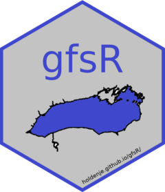

# gfsR 

The package contains a suite of tools helpful for working with FishNet2 data files. The primary functions provide a convenient way of unzipping `DATA.ZIP` archive files and reading them directly in to the R working environment.

The most up to date version can be installed using:
`devtools::install_github("HoldenJe/gfsR")`

## Contributions
Contributions from users are welcomed. Please review [CONTRIBUTING Guidelines](CONTRIBUTING.md) for work flow instructions.

## Examples
- Creel data archive  
`creel <- import_fn_creel("~/FNData/WCH/SF18_WCH/DATA.ZIP")`  
`lapply(creel, head)`

- Index Netting Project  
`nscin <- import_fn_index_net("~/FNData/NS1/IA02_NS1/DATA.ZIP")`  
`lapply(nscin, head)`

---

## See also:
`rprocval`: tools for checking data structure and biological attributes  
https://github.com/HoldenJe/rprocval

[Fishnet Migration Manual](https://fishnetmigration.github.io/FN2DataMigrationManual/) - *an ongoing work-in-progress*

